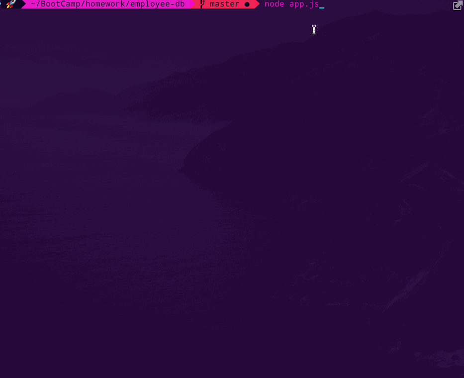

# CLI Employee Tracker
A CLI app to build & manage teams of employees. The application prompts the user for information about the various employees, their roles and departments; querying a MySQL database & ultimately inserting or updating the relevant item. This app runs in a Node environment and leverages the Inquirer & MySQL packages.

<p align="center">
   
</p>

## Installation & Getting Started

1. Clone from the [Repo](https://github.com/Spazcool/employee-tracker), install modules & run app: 

  ```
  git clone https://github.com/Spazcool/employee-tracker.git
  ```
2. Install dependencies:

  ```
  npm install
  ```
3. Create .env file at root directory, change values as needed (for use with MySQL database):
  ```
  DB_PASSWORD='password'
  DB_HOST='localhost'
  DB_USER='root'
  DB_NAME='cms_db'
  DB_PORT='3306'
  ```
4. Create MySQL Database:
  * Install: 
    * [MySQL Install (Mac)](https://dev.mysql.com/doc/mysql-osx-excerpt/5.7/en/osx-installation-pkg.html)
    * [MySQL Workbench](https://www.mysql.com/products/workbench/)
  * Run MySQL, from System Prefrences.
  * Open MySQL Workbench
    * Copy/paste [seed file](db/seed.sql) from this repo
    * Run seed

5. Run application:

  ```
  node app.js
  ```

## Prerequisites

* Node.js

## Built With

* Node
* Inquirer
* MySQL
* DotEnv
* Console-Table-Printer

## Future Features

* View Teams (i.e. employees by manager)
* Auto-fill previous values when updating an item
* Confirmation on Update/Delete
* Delete departments, roles, and employees (i.e. without having to delete associated tables first)
* View the total utilized budget of a department (i.e. the combined salaries of all employees in that department)
* Return to Previous Menu option on all sub-menus
* Manager as a reserved keyword
* Additional input validation
* View Row with relations (e.g. Employee + Role + Manager + Department)
* Exit Application

## Authors

* **Douglas Wright** - [Spazcool](https://github.com/Spazcool)

## License

This project is licensed under the MIT License - see the [LICENSE.md](LICENSE.md) file for details.
